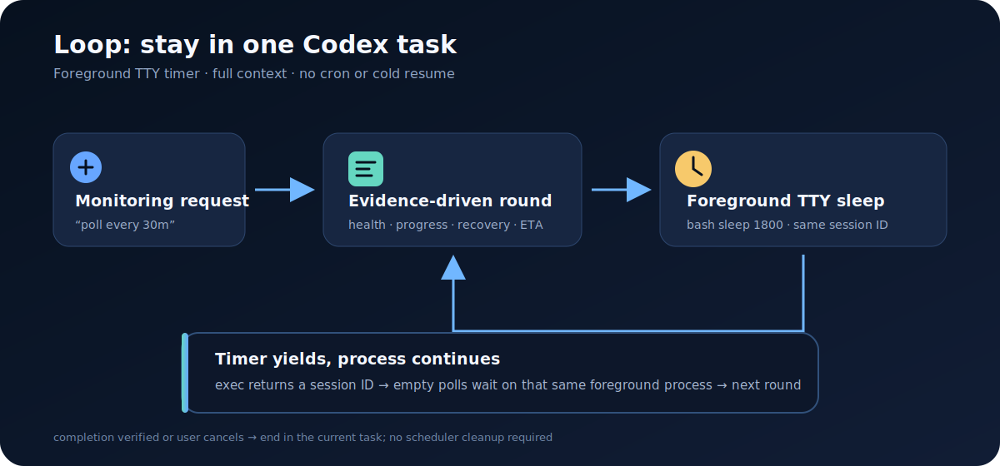
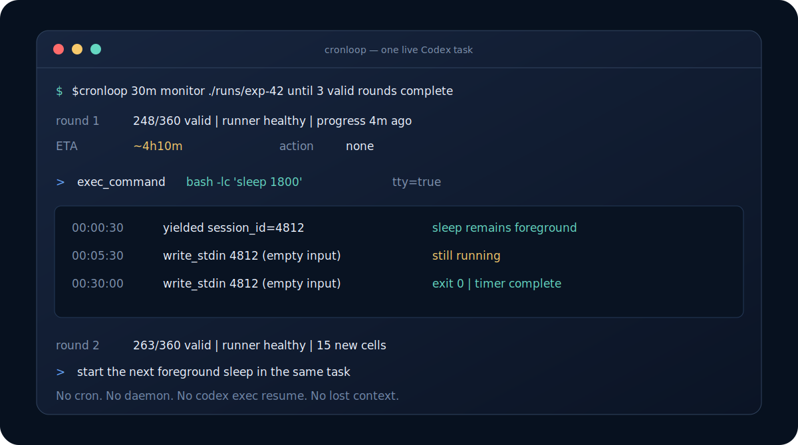

# Cronloop for Codex CLI

[简体中文](README.zh-CN.md) · [Example](examples/benchmark-monitoring.md) · [Changelog](CHANGELOG.md) · [MIT License](LICENSE)

Cronloop keeps one Codex task open and alternates between an agent monitoring round and a foreground TTY `bash sleep`. A request such as “check this experiment every 30 minutes” no longer installs cron or repeatedly launches `codex exec resume`.



## Why this design

The original Cronloop used crontab to resume an exact Codex thread on every tick. That was durable, but each round required a fresh CLI/model invocation plus scheduler state, locking, logs, and cleanup. The new design is intentionally lighter:

- one continuous Codex task with its full current context;
- a real foreground `sleep 1800` or `sleep 3600` inside a PTY;
- no crontab entry, daemon, thread lookup, state directory, or cold resume;
- one evidence-driven agent round when the timer finishes;
- immediate user steering or cancellation in the same task;
- optional external delivery of each completed round when explicitly requested.

The shell sleep may last much longer than 60 seconds. Codex's execution tool can yield a session ID while that same foreground process continues, then poll it in supported chunks. A limit on one tool call's wait time is not a limit on the PTY process lifetime.

## Requirements

- Codex CLI with PTY command execution and session polling (`exec_command` and `write_stdin`)
- A Codex task that remains open for the full monitoring period
- Bash and `sleep`
- Optional Feishu notifications: an authenticated [`lark-cli`](https://open.feishu.cn/document/no_class/mcp-archive/feishu-cli-installation-guide.md) or another configured Feishu connector

The core loop has no Python package, cron daemon, or third-party dependency.

## Install

```bash
git clone https://github.com/Micuks/codex-cronloop-skill.git
mkdir -p ~/.codex/skills
ln -s "$PWD/codex-cronloop-skill/cronloop" ~/.codex/skills/cronloop
```

Restart Codex CLI if the skill is not discovered in the current process. To install without a symlink, copy the `cronloop/` directory to `~/.codex/skills/cronloop/`.

## Quick start

Ask in the task that should remain in the loop:

```text
$cronloop 30m monitor ./runs/exp-42. Check process health, newest logs,
result validity, and free disk space. Safely restart only after proving the
runner is dead and no duplicate exists. Stop after all 3 rounds pass validation
and results.xlsx is built.
```

Cronloop checks once immediately, reports the evidence, and—if incomplete—runs a foreground TTY timer equivalent to:

```text
exec_command:
  cmd: bash -lc 'sleep 1800'
  tty: true
  yield_time_ms: 30000
```

When the execution call yields a session ID, Codex waits on that same process with empty `write_stdin` polls. When the timer exits, the next monitoring round begins in the same task.



### Optional Feishu notifications

Ask for the final report from each completed monitoring round to be sent to Feishu:

```text
$cronloop 30m monitor ./runs/exp-42 and notify me in Feishu after each
completed check. Stop when all three rounds are valid.
```

Notifications are opt-in. Cronloop verifies the configured identity and target, sends only completed monitoring reports—not sleep-poll heartbeats—and redacts secret-like fields and credential-bearing URLs. Delivery is fail-open: an alert failure is reported in the current task without turning a healthy monitoring round into failure or stopping the foreground TTY loop.

Intervals use integer minutes, hours, or days, for example `30m`, `45m`, `1h`, `2h`, and `1d`. The default minimum is 30 minutes; shorter intervals may be used when the user explicitly requests a test.

## Effect example

The included [benchmark-monitoring example](examples/benchmark-monitoring.md) models an 8-configuration × 15-query × 3-round experiment:

1. The agent checks the runner, newest logs, result matrix, disk, and load immediately.
2. If incomplete, it starts `sleep 1800` as the foreground process in a PTY.
3. The execution tool may yield, but the same shell process owns the timer; Codex polls its session rather than starting a new timer.
4. At expiry, the agent checks the experiment again with the full task context.
5. The loop ends only after completion is verified, the user cancels it, or the live TTY session is irrecoverably lost.

## Safety and trade-offs

| Concern | Behavior |
|---|---|
| Accidental background scheduler | Never creates cron, daemon, tmux, nohup, or Scheduled Tasks |
| Timer duplication | Polls one returned session ID and never restarts the interval after a normal yield |
| Unsupported long tool wait | Uses the longest supported poll chunk while the foreground process continues |
| Recovery exceeds authority | Diagnoses first and performs only recovery explicitly authorized by the user |
| Notification leaks credentials | Redacts secret-like fields and credential-bearing URLs before delivery |
| Notification outage breaks monitoring | Delivery failure is isolated from monitoring and reported in the current task |
| User changes direction | Handles new input in the same task; cancellation interrupts the live TTY |
| Client exits or host reboots | Loop stops; this lightweight mode is intentionally not durable |
| TTY session is lost | Reports the loss instead of fabricating an approximate timer |

Cronloop is designed for interactive experiment supervision. Use a durable external scheduler only when surviving client exit or host reboot matters more than keeping one lightweight agent turn alive.

## Repository layout

```text
cronloop/                 installable Codex skill
  SKILL.md
  agents/openai.yaml
docs/images/              diagrams used by both READMEs
examples/                 expanded monitoring example
tests/                    static contract checks
```

## Development

```bash
python3 -m unittest discover -s tests -v
```

The tests do not start a real long sleep, modify machine scheduler state, or send a real notification.

## License

[MIT](LICENSE)
